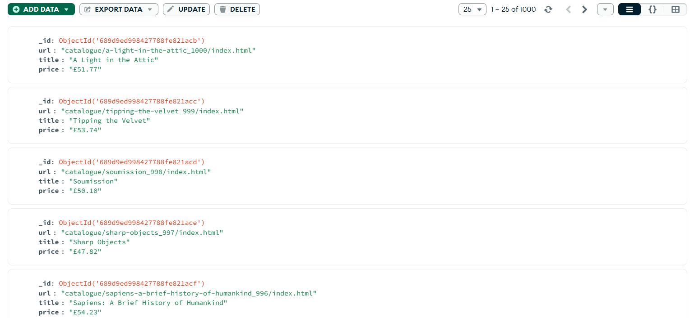

# Scrapy + MongoDB Book Scraper
This project scrapes book data and stores it in MongoDB.
# 📚 Scrapy + MongoDB Book Scraper


This project is a **web scraper built with Scrapy** that extracts book details from a sample website and stores them in **MongoDB** for easy access, analysis, and future use.

## 🚀 Features
- Scrapes **Title**, **Price**, and **Book URL**
- Stores results in a MongoDB database
- Easy to configure and extend for other websites
- Lightweight & fast scraping

---

## 🛠️ Tech Stack
- **Python 3.x**
- **Scrapy** – For crawling and scraping data
- **MongoDB** – For storing scraped data
- **Pymongo** – Python driver for MongoDB

---

## 🛠 Installation & Usage

### 1️⃣ Clone the repository
```bash
git clone https://github.com/your-username/scrapy-mongodb-book-scraper.git
cd scrapy-mongodb-book-scraper
```

### 2️⃣ Create & activate a virtual environment
```
# Windows
python -m venv .venv
.\.venv\Scripts\activate

# Mac/Linux
python3 -m venv .venv
source .venv/bin/activate
```

### 3️⃣ Install dependencies
```
pip install -r requirements.txt
```

### 4️⃣ Ensure MongoDB is running locally
```
# Example: Start MongoDB service (depends on OS)
mongod
```

### 5️⃣ Run the spider
```
scrapy crawl book
```

### 📸 Project Screenshot



### 📄 Sample document in MongoDB
```
{
    "title": "1,000 Places to See Before You Die",
    "price": "£26.00",
    "url": "1000-places-to-see-before-you-die_1/index.html"
}
```


### 📢 Author

Developed by Vimali Subramanian

📬 Reach me on [LinkedIn](https://www.linkedin.com/in/vimali-s-564405253/)


